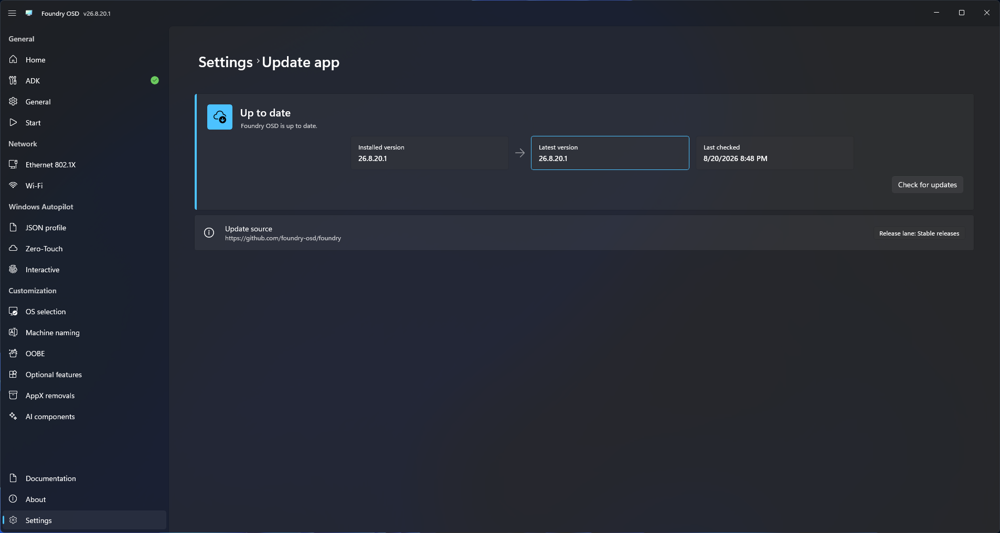

# Settings

Foundry OSD settings mostly control the desktop application. The telemetry toggle also affects the runtime telemetry configuration written during media creation. Proxy settings are limited to the Foundry OSD application.

## General

Configure:

- Whether Foundry OSD starts automatically with Windows.
- The application display language.
- Developer diagnostics.
- Access to the application log directory.

Changing application language updates the authoring interface. It does not select the Windows PE or deployed Windows language.

### Export diagnostics

Use **Export diagnostics** to create a sanitized support archive. Sanitization is applied to the exported copy and does not modify the original application logs.

Use **Advanced: export raw logs** only when explicitly requested by a trusted support contact. Raw logs can contain credentials, identifiers, file paths, network names, and other sensitive data. Review the destination and handle the archive according to the organization’s security policy.

## Proxy

Use **Proxy** when Foundry OSD must connect to online services through an organization-managed proxy.


These settings apply only to the Foundry OSD desktop application. They are not added to ISO or USB media and do not configure Foundry Connect or Foundry Deploy.


Choose a connection method:

- **Use Windows settings** uses the proxy configuration available to Windows and is recommended when the workstation is already managed by the organization.
- **Manual proxy** uses the server address, port, and bypass rules entered in Foundry OSD.
- **No proxy** connects directly and ignores the Windows proxy configuration.

For a manual proxy, enter an `http://` or `https://` server address and a port from 1 to 65535. Enable local-address bypass when host names without a dot should connect directly. Add optional host names or wildcard patterns to the bypass list, separated with semicolons.

Choose how Foundry OSD authenticates to a manual proxy:

- **Use current Windows credentials** uses the identity of the signed-in Windows user.
- **No authentication** sends no proxy credentials.
- **Username and password** uses the supplied username, password, and optional domain.

Explicit credentials are stored in Windows Credential Manager and are not written to the Foundry settings file. Applying a method that does not use explicit credentials removes the previously stored proxy credential.

Select **Apply** to save the settings and use them for new Foundry OSD connections. Select **Test connection** to test the values currently displayed without saving or applying them. The test checks access to GitHub, Microsoft sign-in, and Microsoft Graph services.


A successful test confirms only those Foundry OSD service checks. It does not validate connectivity from Windows PE, Foundry Connect, Foundry Deploy, or the installed Windows system.


## Telemetry

Use **Enable telemetry** to control anonymous product telemetry. Use **Enable remote diagnostics** to control privacy-filtered operational logs and exception details. Both settings are enabled by default and can be disabled independently.

- Both toggles apply to the Foundry OSD desktop application.
- Both preferences are synchronized into the runtime configuration used when media is created.

Telemetry excludes names, secrets, SSIDs, IP addresses, file paths, disk identifiers, computer names, Autopilot profile names, serial numbers, and hardware hashes. Deployment telemetry can include the device vendor and model. Events use an anonymous identifier created for the Foundry installation.

When telemetry is enabled, Foundry OSD can report the selected proxy method and, for a manual proxy, the authentication mode. It does not report the proxy address, port, bypass list, username, domain, password, PAC details, credentials, or tested URLs.

Remote diagnostics include warning, error, and fatal events, plus explicitly marked terminal workflow diagnostics. Foundry applies an explicit property allowlist and sanitizes paths, URIs, credentials, tokens, network identifiers, machine names, user names, and similar direct identifiers before delivery to PostHog. Local logs remain the authoritative diagnostic source and are not modified by remote export.

Remote delivery is best effort and does not use a persistent outbox. Records can be dropped when the queue is full, the application exits, the network is unavailable, or PostHog rejects a request. Disabling remote diagnostics stops new records from entering the delivery queue.

See [Telemetry and privacy](../reference/telemetry-and-privacy.md) for the complete data and delivery boundaries.

## Theme

Choose:

- Light, dark, or system-default application theme.
- Mica, Mica Alt, Acrylic, or Acrylic Thin backdrop.
- Windows accent-color settings.

Theme changes affect only the Foundry OSD authoring interface and do not alter deployment media.

## App updates

Review:

- Installed and available versions.
- Last update-check time.
- Configured update source.
- Release notes.

Use **Check for updates** to refresh status. When an update is available, review the release notes, then use the download and restart action. Complete the update before creating media when the release contains required compatibility or deployment fixes.

<figure>
  
  <figcaption>Review the installed version, update status, and available update actions.</figcaption>
</figure>
