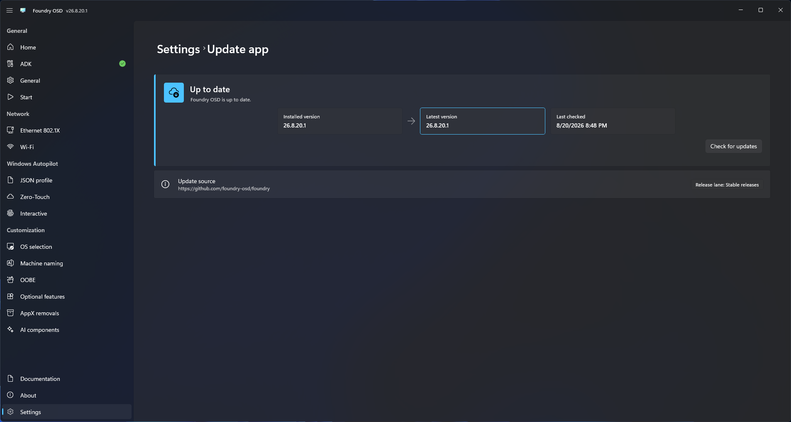

# Settings

Settings holds the options of the Foundry OSD application itself: language, appearance, saved configurations, proxy, telemetry and updates. Open it with **Settings** at the bottom of the navigation pane. The sections below follow the cards of the page from top to bottom.


**Screenshot required**

- **File:** `foundry-osd-settings-02-backup-and-sync.png`
- **Capture:** Show the whole **Settings** page of a released build with its seven cards, **Settings backup and sync** expanded, and the current navigation pane.


Except for **Settings backup and sync**, these choices are stored for the workstation, so they apply to every Windows account that uses Foundry OSD on it.

## General

| Option | What it does |
| --- | --- |
| **Language** | Changes the language of Foundry OSD at once. It does not change the language of Windows PE or of the deployed Windows. |
| **Export diagnostics** | Shows the log folder, normally `%ProgramData%\Foundry\Logs`, as a link that opens it. **Export...** asks for a destination and creates an archive of the Foundry OSD logs with sensitive values masked. |
| **Advanced: export raw logs...** | Creates the same archive without masking. Use it only when a support contact asks for it: raw logs can contain credentials, identifiers, paths and network names. |

A dialog titled **Diagnostics exported** gives the path of the archive. The export does not include the logs of target devices; for those, see [Logs and support information](../troubleshooting/logs-and-support.md).

## Appearance

| Option | Choices |
| --- | --- |
| **App theme** | **Light**, **Dark**, **System** |
| **Material** | **Mica**, **Mica Alt**, **Acrylic**, **Acrylic Thin** |
| **Accent color** | **Open** opens the color settings of Windows, where the accent color is chosen. |

## Settings backup and sync

A configuration is the set of deployment options you chose in Foundry OSD. This card selects the configuration in use, exports it to a file, imports one, and can keep a configuration synchronized between workstations through a shared network folder. Configurations belong to your Windows account.

All of it is explained in [Settings backup and sync](deployment-profiles.md).

## Proxy

Use **Proxy** when the workstation reaches the Internet through a proxy. These settings apply to Foundry OSD only: they are not written to the media and do not affect Foundry Connect or Foundry Deploy.

1. Choose a **Proxy method**: **Use Windows settings (recommended)**, **Manual proxy** or **No proxy (direct connection)**.
2. For **Manual proxy** only, fill in:
   - **Proxy server**: the address and the port (default 8080, from 1 to 65535). An address without `http://` or `https://` is treated as `http://`.
   - **Bypass local addresses** (on by default) and **Bypass list**, for hosts to reach directly, separated by semicolons.
   - **Authentication**: **Use current Windows credentials**, **No authentication** or **Username and password**. Credentials you type are stored in Windows Credential Manager.
3. Select **Test connection**. Foundry OSD tries `github.com`, `login.microsoftonline.com` and `graph.microsoft.com`, for up to 15 seconds each.
4. Select **Apply**.

A successful test proves that these three hosts answer, not that every download will. The full list is in [Network endpoints](../reference/network-endpoints.md).

## Enable telemetry and Enable remote diagnostics

Both switches are on by default.

| Switch | Sends | Takes effect |
| --- | --- | --- |
| **Enable telemetry** | Anonymous usage events | After you restart Foundry OSD |
| **Enable remote diagnostics** | Application logs and error reports, kept 7 days | At once |

The choice is also written to the media you create afterwards. Existing media keeps the choice it was created with. Log files on the workstation are written whatever you choose. [Telemetry and privacy](../reference/telemetry-and-privacy.md) lists what is sent.

## Update app

Foundry OSD updates itself from the releases of the `foundry-osd/foundry` repository on GitHub. You do not need to download the MSI again.

1. At each start, Foundry OSD checks for a newer release and downloads it in the background.
2. While an update is known, an **Update** item appears at the bottom of the navigation pane. It reads **Downloading: N%**, then **Apply update**.
3. Select **Apply update** to install the update and restart Foundry OSD. If you do nothing, the update is installed when you close the app, which then stays closed.

The **Update app** page shows **Installed version**, the available or latest version, **Last checked** and the **Update source**. **Check for updates** checks at once, **Download update** and **Apply update** do each step by hand, and **Release notes** appears when an update is available.

<figure>
  
  <figcaption>The Update app page when no update is available.</figcaption>
</figure>

If you start a media creation while an update is known, a dialog titled **Update Foundry OSD before creating boot media** offers **Apply update** (or **View update** while it is still downloading), **Create anyway** and **Cancel**. Applying first is the safe choice: the media then carries the latest fixes.

An update is not installed on closing while a second Foundry OSD window is open. Close every window, or select **Apply update**.

## Related

- [Settings backup and sync](deployment-profiles.md)
- [Telemetry and privacy](../reference/telemetry-and-privacy.md)
- [Network endpoints](../reference/network-endpoints.md)
- [Foundry OSD application troubleshooting](../troubleshooting/foundry-osd.md)
