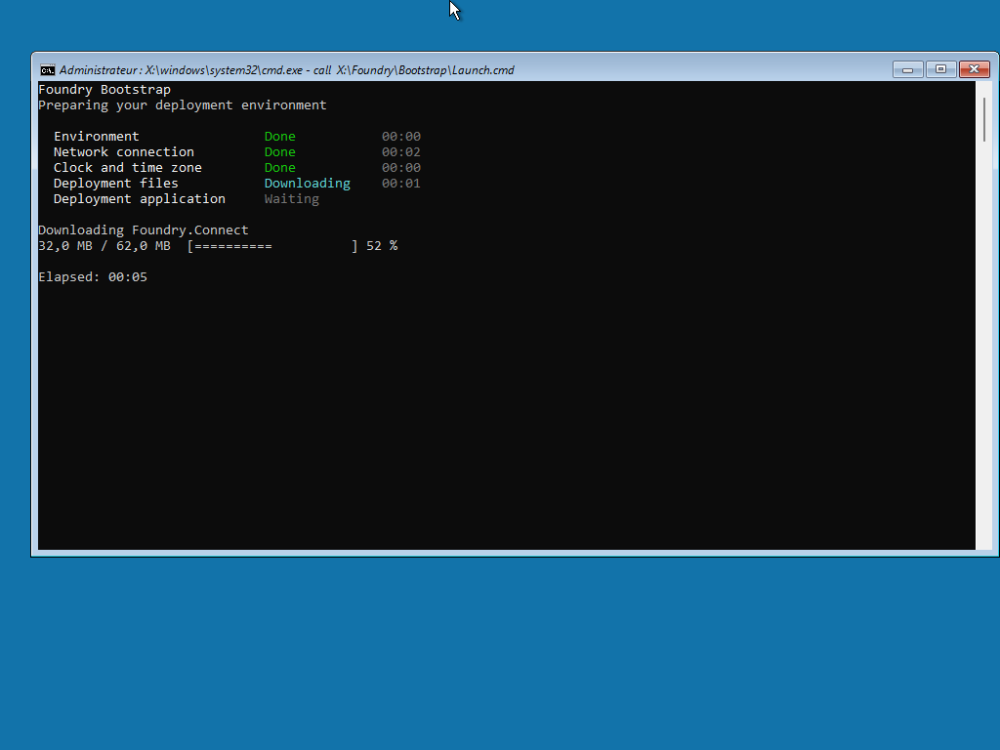

# Windows PE bootstrap

Foundry Bootstrap prepares the Windows PE session, starts Foundry Connect, and launches Foundry Deploy after Connect succeeds. Use this page to follow startup progress or investigate a problem before the deployment wizard appears.

<figure>
  
  <figcaption>Follow startup stages and payload download progress in the Windows PE console.</figcaption>
</figure>

## Boot media preparation

Foundry OSD includes Bootstrap in every ISO and USB boot image at `X:\Foundry\Bootstrap\Foundry.Bootstrap.exe`. Windows PE runs `wpeinit` before launching it.

During media creation, release provisioning downloads the Bootstrap archive for the selected architecture from GitHub. Runtime downloads in the same media build use one release snapshot. If a required asset is missing or invalid, media creation fails with an error.

Local development provisioning uses a supplied archive or publishes the local project. It does not fall back to a GitHub download when the local Bootstrap payload cannot be prepared.

Bootstrap stays in the boot image while Connect and Deploy use their runtime caches. To refresh Bootstrap, [recreate or update the boot media](supported-versions.md#application-and-boot-media-updates).

## Startup progress

Bootstrap clears the interactive console once and updates five stage rows in place:

| Stage | What happens |
| --- | --- |
| Environment | Selects the x64 or ARM64 runtime and storage location, then prepares wired authentication and supported wireless services. |
| Network connection | Resolves Foundry Connect, starts it, and waits for the network workflow to finish. |
| Clock and time zone | Attempts to correct the clock and configure the time zone after Connect succeeds. |
| Deployment files | Resolves Foundry Deploy. On release-provisioned USB media, also checks for a Connect runtime update. |
| Deployment application | Launches Foundry Deploy and waits for its startup acknowledgement. |

Text statuses identify waiting, in-progress, completed, failed, and cancelled work. Stage labels remain white, while statuses use green for completion, cyan for active work, yellow for warnings or cancellation, and red for failure. Each started stage shows its duration in grey. Downloads have a dedicated progress line with transferred data, a bar, and a percentage when the total size is available; total elapsed time remains visible throughout startup. Archive verification and native ZIP extraction show measured progress bars. Cache replacement uses an activity indicator because directory moves do not provide a byte-based percentage.

Warnings remain visible after their stage completes. The final subtitle identifies readiness, cancellation, or failure. The result retains a warning summary and provides the log location when attention is needed. Normal cancellation without warnings does not display a diagnostic footer. If the console is too small, output is redirected, or cursor positioning is unavailable, Bootstrap uses plain sequential output.

A warning describes a recoverable issue; startup can continue. A failure identifies the affected stage and displays the diagnostic session ID and log location.

The final ready message confirms that Deploy initialized its services and displayed a usable interface. A deployment password prompt counts as a usable interface; readiness does not mean that deployment has started or finished.

Closing or cancelling Foundry Connect stops the boot workflow; it does not bypass network readiness. A Connect startup or configuration failure also prevents Deploy from launching. See [Network readiness](../foundry-connect/network-readiness.md) for the technician workflow.

## Startup confirmation

Connect and Deploy acknowledge managed startup, configuration loading, and UI readiness. Bootstrap waits up to two minutes for the first usable UI. After Connect acknowledges readiness, its network workflow can continue for as long as the technician needs; successful completion is still required before Deploy starts.

If readiness is not confirmed within two minutes, Bootstrap stops with a timeout and preserves the last acknowledged stage. The application may still be running. Bootstrap does not kill or restart it, so inspect the screen and logs before trying another launch.

Payloads without a compatible startup capability manifest keep process-only observation. Bootstrap shows a warning and reports readiness as unverified. An invalid manifest stops startup instead of silently bypassing confirmation. Recreate the media or refresh the affected runtime cache when investigating invalid startup metadata.

When an application reports a startup failure, Bootstrap allows up to five seconds for the child to exit so it can recover the diagnostic record. It does not terminate the child if that wait expires.

An exit before Deploy handoff is a startup failure, even if a ready message was written just before it exited. Once Bootstrap confirms the handoff, later deployment errors belong to Deploy.

## Cache and connectivity

A volume labelled **Foundry Cache** takes precedence for runtime storage. Otherwise, Bootstrap uses `X:\Foundry\Runtime` in temporary Windows PE storage.

Bootstrap tries to use an available Connect runtime before requiring a release lookup, so Connect can help establish networking. Application release lookup or download failures can fall back to usable cached content or an embedded archive when one is available. A fallback warning can therefore be followed by a successful launch.

A cache does not guarantee a fully offline deployment. Connect still requires its connectivity checks to succeed, and the selected Windows, drivers, catalogs, or Autopilot workflow may require additional services. If neither usable local content nor a downloadable runtime is available, boot stops before the affected application launches.

Debug-provisioned runtimes skip the normal release update lookup. Record whether the media uses release or debug content when reporting a startup problem.

## Collect startup evidence

Record the last console stage, the displayed result, and the diagnostic session ID. Bootstrap, Connect, and Deploy share that ID so their log entries can be matched across the same boot.

Start with `FoundryBootstrap.log`, then collect the affected application's log. See [Windows PE log location](../troubleshooting/logs-and-support.md#windows-pe-log-location) for filenames, cache copies, and the information to preserve before rebooting.

Each supervised launch also has a `Startup\<launch-id>` directory under its diagnostic session directory. `status.json` contains the last startup acknowledgement. When remote diagnostics permit it, `startup-failure.json` preserves a sanitized child exception for recovery. A terminating crash may leave minimal evidence in `startup-terminated.txt`. These files supplement the application logs.

If Bootstrap does not display any progress, inspect `X:\Foundry\Logs\FoundryBootstrap.Launcher.log`. The Windows command launcher records the launch attempt and exit code even when the .NET runtime cannot start.

Bootstrap reports a product event only when startup fails. Remote application logs and Error Tracking reports are controlled separately from product telemetry. Delivery starts after network and clock preparation, with a bounded attempt when startup stops earlier. See [Bootstrap reporting](telemetry-and-privacy.md#bootstrap-reporting) for consent, pending records, and delivery limits.


**Unreleased: unified application logging**

The upcoming release sends emitted Bootstrap application logs to PostHog after remote-diagnostics consent is known. Earlier startup failures and internal delivery-health warnings remain local. Logs captured before network preparation keep their original timestamps and process sequence, with recognized authentication secrets masked in both local and remote output. Pending logs can be retried after a restart if their storage survives; data held only in memory or on `X:` is lost on reboot. Foundry's PostHog logs are automatically deleted after 7 days. Local files follow separate retention rules.


For refreshing existing media, see [Application and boot media updates](supported-versions.md#application-and-boot-media-updates).
