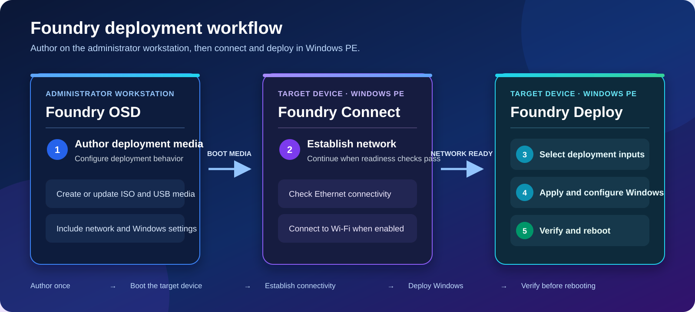

# Deployment workflow

Foundry separates authoring from runtime deployment.

## Phase 1: Author deployment media

Use **Foundry OSD** on an administrator workstation to:

- Install or validate Windows ADK and Windows PE components.
- Configure networking and deployment behavior.
- Select Windows customization options.
- Configure an optional Windows Autopilot workflow.
- Create or update ISO and USB media.

## Phase 2: Establish network readiness

Boot the target device into Windows PE. **Foundry Connect** checks Ethernet and, when enabled, Wi-Fi connectivity. Deployment continues when the configured readiness checks succeed.

The [Windows PE bootstrap](../reference/bootstrap.md) prepares this session and launches Connect and Deploy in order. Closing Connect stops that sequence.

## Phase 3: Select deployment inputs

**Foundry Deploy** guides the technician through:

- Target disk and computer name.
- Windows release, language, edition, and license channel.
- Driver pack selection.
- Firmware and Windows Autopilot options when configured.

## Phase 4: Apply and configure Windows

Foundry prepares the target disk, downloads and applies Windows, stages drivers and configuration, provisions recovery and optional features, and completes the deployment handoff.

## Phase 5: Verify and reboot

Review the completion state, deployment summary, and any reported error. Reboot only after Foundry reports success or after collecting the required troubleshooting evidence.

<figure>
  
  <figcaption>
    Foundry OSD authors deployment media, Foundry Connect establishes network readiness, and Foundry Deploy applies and verifies Windows.
  </figcaption>
</figure>

## Use a custom Windows image (unreleased)

Before creating media, optionally [import and include custom Windows images](../foundry-osd/customization/custom-windows-images.md). Boot the complete ISO or USB, complete Foundry Connect, and select the image and exact index in Deploy. Existing network prerequisites and enabled customizations continue to apply.
